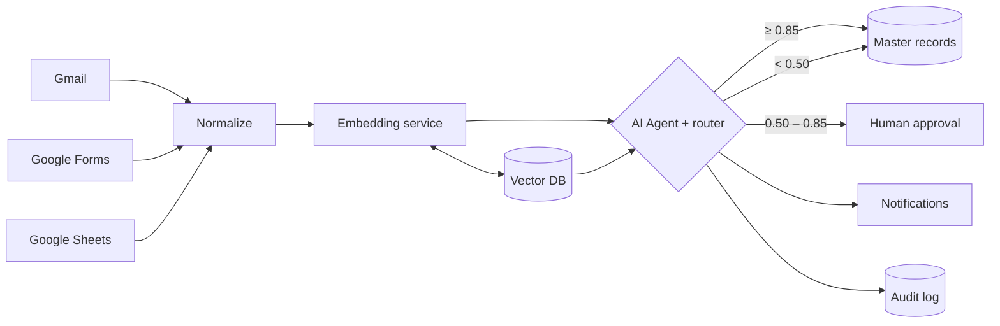

# Opsis

**One person. One record. Zero manual merging.**

Opsis is an autonomous entity resolution agent built on **n8n**. It ingests records from email, web forms and spreadsheets, works out whether each one is a new person or someone you already have, decides what to do, and does it. Humans only see the cases it is unsure about.

> Built for **Hack Sprint 2026** · Track: **AI Automation with n8n**
> Status: 🚧 In active development

---

## The problem

The same customer, lead or patient reaches an organization through several channels:

| Source | Record |
|---|---|
| Gmail | Rahul Sharma · rahul.sharma@acme.in |
| Web form | R. Sharma · +91 98765 41200 |
| Spreadsheet | Sharma, Rahul · Acme Pvt Ltd |

There is no shared ID, so staff search, compare and merge these by hand. The work is **repetitive**, the data is **fragmented**, and every record needs a **decision**: merge, create, or follow up. The result is duplicate records, duplicate outreach and missed follow-ups.

## The solution

Opsis turns that process into an n8n workflow with an AI agent at its center.

1. **Ingest:** Gmail, Google Forms and Google Sheets triggers feed one normalized record.
2. **Resolve:** a fine-tuned embedding model retrieves the closest existing records from a vector store.
3. **Decide:** an AI agent compares the record against the candidates and returns `merge`, `create` or `escalate`, with a confidence score and written reasoning.
4. **Act:** it updates the master record, sends confirmations, or asks a human to approve.

Every decision is written to an audit log.

## Why it is more than a workflow

- **Multi-step reasoning:** the agent compares candidates field by field before it commits.
- **Tool use:** it looks up email history and master records instead of guessing.
- **Confidence-gated autonomy:** it acts alone when it is sure and escalates when it is not.
- **Full audit trail:** every decision is logged with its confidence and reasoning, so it can be reviewed and tuned.

## Decision logic

| Confidence | Action |
|---|---|
| `≥ 0.85` | **Auto-merge** into the master record and send a confirmation |
| `0.50 – 0.85` | **Ask a human** via Slack or Telegram with approve and reject buttons |
| `< 0.50` | **Create a new record** |

Thresholds are starting values and are tuned on labeled record pairs.

## Architecture



## Tech stack

| Layer | Tool |
|---|---|
| Orchestration | n8n (Triggers, Code, HTTP Request, AI Agent nodes) |
| Matching | Fine-tuned embedding model served with FastAPI |
| Memory | Vector store (Qdrant or pgvector) |
| Reasoning | LLM through the n8n AI Agent node, with lookup tools |
| Interfaces | Gmail, Google Forms, Google Sheets, Slack or Telegram |

## Repository structure

```
Opsis/
├── workflows/            # Exported n8n workflow JSON
├── embedding-service/    # FastAPI service for the embedding model
├── data/                 # Sample records for the demo
├── docs/                 # DFD and design notes
└── README.md
```

## Getting started

### Prerequisites

- Docker
- Python 3.10+
- An LLM API key for the n8n AI Agent node
- Google account credentials for Gmail, Forms and Sheets in n8n

### 1. Run n8n

```bash
docker run -it --rm -p 5678:5678 -v n8n_data:/home/node/.n8n n8nio/n8n
```

Open `http://localhost:5678`.

### 2. Run the vector store

```bash
docker run -p 6333:6333 qdrant/qdrant
```

### 3. Run the embedding service

```bash
cd embedding-service
pip install -r requirements.txt
uvicorn app:app --host 0.0.0.0 --port 8000
```

If n8n runs in the cloud, expose the service with a tunnel such as `ngrok http 8000`.

### 4. Import the workflow

In n8n, go to **Workflows → Import from file**, select the JSON in `workflows/`, then add your credentials and the embedding service URL.

### 5. Try it

Load the sample records from `data/` into the connected sheet or send a test email, and watch the agent resolve, decide and act.

## How we measure success

The core metric is the **share of records resolved without human review**, measured on a labeled test set, alongside merge precision so automation never comes at the cost of wrong merges.

## Roadmap

- [x] Problem definition, architecture and DFD
- [ ] n8n workflow skeleton with triggers and normalization
- [ ] Embedding service and vector store integration
- [ ] AI agent with confidence routing and human approval
- [ ] Audit log and evaluation on labeled pairs
- [ ] Live demo with edge cases

## Use cases

- **Sales and CRM:** duplicate leads from forms, email and spreadsheets
- **Healthcare front desk:** duplicate patient registrations across intake channels
- **Recruiting:** the same candidate across job boards, referrals and email

## Team

| Member | Focus |
|---|---|
| **Aneesh** | n8n ingestion, normalization and triggers |
| **Khajesh** | Embedding service, vector store and matching |
| **Eashwar** | Agent prompt, approval flow, repo and slides |

---

*Opsis* is Greek for "sight", a single clear view of every entity.
